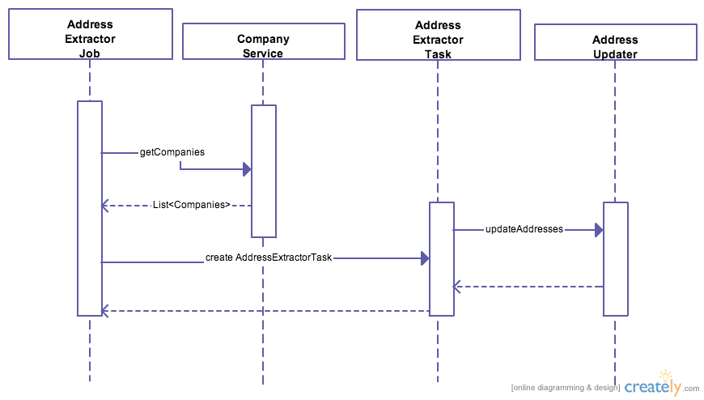
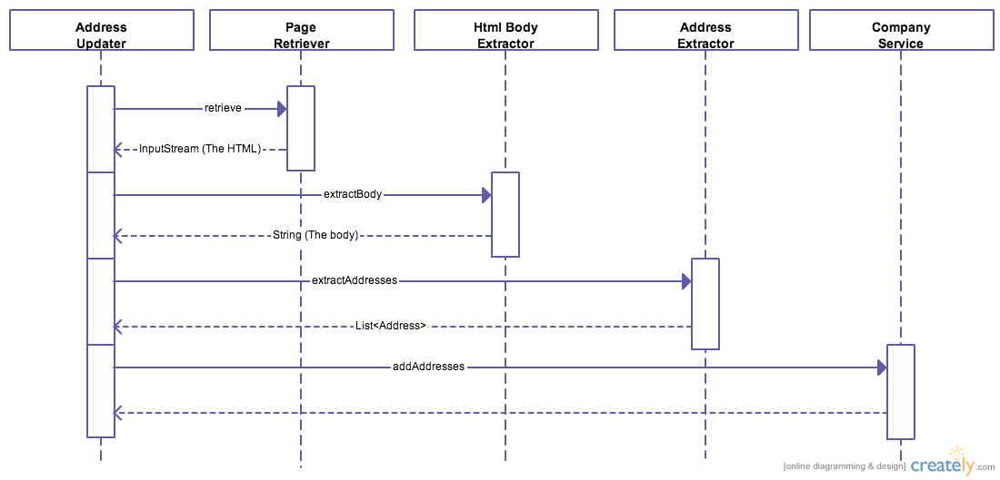

## README

### Important

This is only the concept part!! The final version will follow!!

### Technologies

- The application is a Spring Batch application.
- I'm using Spring Boot to quickly start the Spring Batch Job.
- I will use JPA to persist the Entities in a database.
- I'm using the Apache Tika library to extract the text inside of the HTML body.
- I will use Lucene to index the text of the body of the HTML, in order to faster find the addresses.

### Flow Description

I start a job. This job retrieves batches of companies.

- For each batch of companies: 
    * I use another thread to process the extraction of addresses. (I use an ExecutorService)
    * For each company in the batch:
        - I retrieve the html from the server, using the url
        - I extract the body of the html, and transform it to text
        - I search and extract addresses from the text of the page
        - I add new addresses to the company, in case they changed
        
## Sequence Diagrams
        
The first part of the flow:

The second part of the flow
